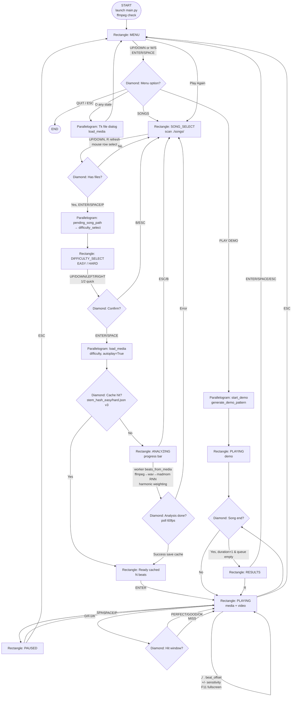

# Radial Rhythm — Game Plan

> Codebase: `C:\Users\LOK0008\rhythmgame\main.py` (2508 lines, `pyglet 2.1.16`, `numpy 2.5.2`, `madmom 0.16.1`, `librosa 1.0.0`)
> State machine: `self.state` (`main.py:970`) — `menu | song_select | difficulty_select | analyzing | playing | paused | results`

---

## 1. Initial Game Idea

**Genre:** Radial / music-synced tap rhythm game. All notes spawn outside and converge linearly to a central target. Player hits the matching lane key at the exact moment the beat reaches the centre.

**Elevator Pitch:** Drop an `mp4 / mp3 / wav / m4a / ogg / flac` into `songs/` (`SONGS_DIR:76`, `SUPPORTED_EXTS:77`), the game auto-generates a beatmap **synced to the actual voice/melody** — not a metronome — using `ffmpeg` + `madmom` `RNNOnsetProcessor` with harmonic/percussive weighting. The video background (if any) stays audio-synced via `pyglet` `FFmpeg` (`PYGLET_FFMPEG_LOCATION:44`, bundled `ffmpeg_shared/ffmpeg-n8.1-latest-win64-gpl-shared-8.1/bin`). Two difficulties share the same voice-first logic at different densities.

**Core Loop:** `Select Song → Choose Difficulty → Analyse (cached next time) → Play → Hit / Miss → Score + Combo → Results → Play Again / Quit`

### 1.1 Radial Mechanic

- Window `1280×720` (`WINDOW_W,WINDOW_H:57`), centre `640,360` (`CENTER:58`), `TARGET_RADIUS=70` (`:59`), `SPAWN_RADIUS=520` (`:60`), `TRAVEL_TIME=1.6s` (`:61`)
- Interpolation each frame (`main.py:2018`): `radius = SPAWN - raw*(SPAWN-TARGET)` where `raw = (beat.time - song_t)/TRAVEL_TIME` (`1` at spawn, `0` at centre), `scale = 0.9+0.35*raw` (`:2028`), `pos = centre + polar(radius, angle)`
- 4 Lanes (`LANES:66-74`, `LANE_ORDER:72`):
  | Lane | Key | Colour | Angle |
  |------|-----|--------|-------|
  | `d` | `D` | `255,74,74` red | 180° left |
  | `f` | `F` | `74,144,255` blue | 90° top |
  | `j` | `J` | `74,255,138` green | 0° right |
  | `k` | `K` | `255,215,74` yellow | 270° bottom |
  `KEY_TO_LANE:73`, `CHAR_TO_LANE:74`

### 1.2 Scoring

`HIT_WINDOW_PERFECT=0.13s → 300pts` (`:62`, `:1535`), `GOOD 0.26s → 150` (`:63`), `OK 0.35s → 50` (`:64`), else `MISS`. `try_hit()` (`:1514`) picks closest `active_beats` within `OK`. Combo `combo++` per hit, `max_combo` tracked (`:1560`), multiplier `1 + min(combo//8,4)*0.25` max `2.0×` at 32 (`:1562`). `MISS` (timeout `>0.35` in `update:1474` or wrong lane) resets `combo=0`. Accuracy on results: `(perfect*1.0 + good*0.7 + ok*0.4)/total*100` (`:2219`).

### 1.3 Beatmap Philosophy

- **Easy** `~1.45 beats/sec` — voice/melody only, fallback to drums only in gaps `>3.5s` where no voice exists (`detect_beats_madmom:507-545`). Example: `Miku 318`, `BIRDBRAIN 372` for `218s/255s`.
- **Hard** `~3.0 beats/sec` — voice-priority but retains percussive fills (`:480-485`). `Miku 656`, `BIRDBRAIN 767`.
- Lane = pitch-aware: spectral centroid `150-4000 Hz` (`_centroids_for_times:679-711`) quantile `0..1` → `pref D/F/J/K`, ergonomic score penalises `recency<0.40*6` + `samePrev<0.55s +1.8` (`:713-775`).
- Tempo `estimate_tempo_autocorr 55-200 BPM` (`:329`) via autocorrelation, cached per difficulty `songs/.cache/<stem>_<md5[:8]>_easy/hard.json v3` (`:148-157`).

---

## 2. Wireframes — Main Screens

> Palette: bg `10,10,18:964`, panels `22,22,34:2209` / `18,18,30:2356`, selected `55,55,90`, accent `100,255,160`, border `120,180,255`, feedback `PERFECT yellow 255,240,80 / GOOD green 100,255,150 / OK blue 100,200,255 / MISS red 255,80,80`

### 2.1 Menu — `on_draw:2289-2349` / `on_key_press:1600`

```
+----------------------------------------------------------+
|                                                          |
|             RADIAL RHYTHM  (40pt bold white)  H-120      |
|     beats converge to centre  •  D  F  J  K  (11pt)     H-155
|  songs in ./songs/ (N found) • add mp4 ...  (9pt)       |
|                                                          |
|              +----------------------------+               |
|              |      PLAY DEMO   420x44    | y=360  (selected: bg 55,55,90 + border 120,180,255 + left 6px accent 100,255,160)
|              +----------------------------+               |
|              |       SONGS               | y=300
|              +----------------------------+               |
|              |       QUIT                | y=240
|              +----------------------------+               |
|                                                          |
|  UP/DOWN or W/S • ENTER/SPACE to select • O open • ESC quit  y=70
|  ● D   ● F   ● J   ● K   (circles 10px per lane colour) y=30
+----------------------------------------------------------+
```
- `3` options `["PLAY DEMO","SONGS","QUIT"]:972`, `UP/DOWN|W/S` cycle `menu_index%3`, `ENTER/SPACE` selects (`:1607`), `ESC` quit, `O` open dialog, `F11` fullscreen, `F1` FPS.
- Click zones `210×26` at `(W/2,360/300/240)` (`:1832`).

### 2.2 Song Select — `2351-2418` / `1623-1664`

```
SELECT SONG  (26pt bold white)  H-50
./songs/  •  N track(s)  •  R refresh  •  O open external  •  B/ESC back  (10pt 140,160,190)

+----------------------------------------------------------+
| panel 880x460 (18,18,30) at 200,100                      |
|  ● BIRDBRAIN ... 38.3 MB   [selected 48,48,82 + | ] y=520|
|  ○ Miku ...                                               y=484
|  ... max 10 rows, y = 520 - rel*36                       |
|  scrollbar track 4x440 (40,40,60) thumb (120,140,190)    |
|  1 / 4    ENTER play  •  UP/DOWN navigate   y=114       |
+----------------------------------------------------------+
| feedback fade 3s at y=60                                  |
```
- Scans `SONGS_DIR` via `get_songs_in_folder:128`, `UP/DOWN|W/S` + scroll `max_visible 10` (`:2367`), `ENTER/SPACE/P` → sets `pending_song_path` → `difficulty_select` (`:1639`), `R` refresh, `B/ESC` → menu. Empty state shows `No songs found.` + drop hint (`:2360`).

### 2.3 Difficulty Select — `2420-2464` / `1665-1694` (NEW)

```
CHOOSE DIFFICULTY  (26pt)  H-70
Miku by Anamanaguchi ...mp4  (11pt Consolas 140,200,255)  H-105

+----------------------------------------------------------+
| panel 640x340 (18,18,30) at 320,180                      |
|  +----------------------------+  y=380  580x90           |
|  | EASY   (18pt bold)        |  bg selected 55,55,90 / unselected 28,28,42 + left 6px accent
|  | melody & voice • ~1.5/s • playable (9pt)  318 beats cached (right 120,200,120)
|  +----------------------------+                          |
|  | HARD                      |  y=270                    |
|  | melody & voice • ~3.0/s • dense challenge            |
|  +----------------------------+                          |
|  UP/DOWN choose • ENTER confirm • 1/2 quick • ESC back  y=194
+----------------------------------------------------------+
```
- `difficulty_options=["EASY","HARD"]:992`, `difficulty="easy":990`, `UP/DOWN|LEFT/RIGHT|A/D` cycle, `ENTER/SPACE` → `load_media(path,difficulty,autoplay=True):1678`, `1/2` quick, `ESC/B` → `song_select`.

### 2.4 Analyzing — `2239-2287` / `1695-1701`

```
[ dim bg 10,10,18 ]
   card 700x260 (22,22,34) centered
   ANALYSING  22pt bold 255,220,100
   Miku by Anamanaguchi ...mp4  11pt (trunc 48)
   Analysing Miku [EASY] 42%  10pt
   [████████████░░░░░░░░]  520x18  bg 40,40,60  fg 100,220,160  shimmer 40px anim 2.5
              42%  (10pt bold white)
   First load analyses via ffmpeg • next load instant (cached)  9pt
   ESC to cancel
```
- Thread `_analysis_thread_func:1233` progress `0..1` (`:1286`), `ESC/B` cancels to `song_select` (thread orphan ignored via `state` check `:1276`).

### 2.5 Playing — `2172-2237` / `1703-1778`

```
video texture cover (scale max(W/tw,H/th) opacity110 + dim 6,6,14 140)  [pyglet player.texture 2109]
          lane lines (2+flash*4) + outer spawn circles 520→70
                     ●---●  beats moving inward scale 0.9+0.35*raw
                     ◎  centre 70 + pulse*22 (layers: shadow+18, outer white 30, main 22,22,34, dot 8+pulse*6)
 D F J K labels at spawn radius
+----------------------------------------------------------+
| top bar 46px (18,18,30,220)                              |
| Score 000123 Combo x8 | 1:23 / 3:38  mode [EASY]         |  top bar: score 14pt bold, hits 11pt Consolas, time 10pt, progress 4px at y=6 (40,40,50 bg 100,255,160 fg = W*song_t/duration)
| P:12 G:3 OK:1 M:2                                        |
|          PERFECT! 24pt yellow scale 1→1.25 fade 1.6s at centre+110
+----------------------------------------------------------+
 D F J K : hit    SPACE pause    ESC menu   (bottom 9pt)
```
- `spawn_beats:1416` when `bt_eff - song_t <= TRAVEL_TIME+0.05`, `get_song_time:1404` prefers `media_player.time`.
- Pooled `game_batch:1020` (36 beats max) `circle 22 / inner 12 / tail Line 90 / hit 28` (`:1061`).

### 2.6 Paused — `2194-2201` / `1780`

```
[ dim 120 (0,0,0) ]
          PAUSED  36pt bold white  H/2+40
   SPACE to resume  |  ESC for menu  12pt 200,220,255
```

### 2.7 Results — `2202-2226` / `1797`

```
[ dim 130 ]
   card 560x360 (22,22,34) at (W-560)/2,(H-360)/2
   RESULTS 22pt 255,255,120
   Score  000456  18pt bold white
   Max Combo x14    Combo x14  12pt 180,220,255
   PERFECT 12  GOOD 3  OK 1  MISS 2  11pt 220,220,240
   Accuracy  87.3%  14pt bold 120,255,150
   Miku by ...mp4  9pt 150,170,200
   ENTER / SPACE / ESC : back to menu    R : replay  10pt
```

---

## 3. User Flow Diagram

> Shape key (Blackjack-style): `Oval` = Start/End, `Rectangle` = Screen, `Diamond` = Decision, `Parallelogram` = Action.



**Textual flow (Start → Screen → Decision → Action → Result):**
`START → MENU → Decision{DEMO/SONGS/QUIT/O} → Action{ENTER} → Result{PLAYING/SONG_SELECT/END/dialog}` → `SONG_SELECT → Decision{file?} → Action{ENTER on row} → DIFFICULTY_SELECT → Decision{EASY/HARD} → Action{ENTER} → Result{Cache? ANALYZING : PLAYING}` → `ANALYZING → Decision{done/error/cancel} → PLAYING or SONG_SELECT` → `PLAYING → Decision{hit/pause/ESC/end} → PAUSED/MENU/RESULTS` → `RESULTS → Play Again (SONG_SELECT) / Quit (END)`.

---

## 4. Main Mechanic — Pseudocode & Diagrams

### 4.1 Radial Convergence

```python
# spawn
beat = {time: t, lane: 'd'|'f'|'j'|'k', angle: LANES[lane].angle, hit: False}
# each frame
song_t = media_player.time if is_media_mode else time.time() - start_time
raw = (beat.time - song_t) / TRAVEL_TIME  # 1 at spawn, 0 at centre
if -0.35 <= raw <= 1.05: draw
radius = SPAWN_RADIUS - raw*(SPAWN_RADIUS - TARGET_RADIUS)  # 520 → 70
scale  = 0.9 + 0.35*raw
pos = (CENTER.x + cos(angle)*radius, CENTER.y + sin(angle)*radius)
# hit burst 0.25s: radius = TARGET + prog*30, alpha 255*(1-prog)
# miss fade 0.45s: grey dim 0.45*col+45, alpha 160*(1-prog)
```

### 4.2 Hit Detection & Scoring

```python
def try_hit(input_lane):
    best = min(active_beats where lane==input_lane and not hit and not missed
               by abs(song_t - beat.time))
    if best is None:
        combo = max(0, combo-1); feedback MISS; lane_flash=0.9; return
    delta = abs(song_t - best.time)
    if delta <= 0.13: pts=300; hits.perfect++; feedback PERFECT yellow
    elif delta <= 0.26: pts=150; hits.good++; feedback GOOD green
    elif delta <= 0.35: pts=50;  hits.ok++;    feedback OK blue
    else: combo=max(0,combo-1); feedback MISS red; return
    best.hit=True; combo+=1; max_combo=max(max_combo,combo)
    mult = 1 + min(combo//8,4)*0.25  # max 2.0 at 32
    score += int(pts*mult); lane_flash=1.2; hit_pulse=1.0

# in update():
for b in active_beats:
    if not hit and song_t - b.time > 0.35:
        hits.miss++; combo=0; b.missed=True; b.miss_time=song_t  # fade 0.45s
```

### 4.3 Beatmap Generation — Voice-First

```python
def beats_from_media(path, difficulty="easy", sensitivity=1.0):
    ffmpeg -y -i path -vn -ac 1 -ar 44100 pcm_s16le tmp.wav
    sr, audio = read_wav_mono(tmp.wav)  # float32 [-1,1]
    if madmom:
        acts = RNNOnsetProcessor(audio, fps=100)  # 100 fps, e.g. 21871 frames for 218s
        voice_w = harmonic_voice_weights(sr, audio, len(acts)) 
          # STFT 1024/hop1024 → median(1,7) harm vs (7,1) perc → flux_h/p → voice_w = harm/(harm+perc) → interp to 100fps, smooth 3
        acts_w = acts * (0.35+0.65*voice_w) if easy else (0.55+0.45*voice_w)
        thr,comb,mg,target = easy(0.32,0.12,0.38,1.45/s) vs hard(0.28,0.10,0.18,3.0/s)
        beats = OnsetPeakPickingProcessor(acts_w, thr, comb) → min_gap mg
        if len > target*1.25: keep strongest by acts_w
        if easy and gaps>3.5s: pool_all = peak(acts, thr0.30) → insert best original in gap
        bpm = estimate_tempo_autocorr(onset_envelope_sfx(hop512), 55-200 BPM)
    else:
        flux = onset_envelope_sfx(log1p(spec*50) flux) → autocorr → dp_beat_track
    if <8: grid 120 BPM
    beatmap = beatmap_from_times(times, dur, sr, audio)  # centroid 150-4000 → rank → pref D/F/J/K + ergonomic
    if sparse: dedup <0.09 else fill gaps >1.7*avg (<4.0) + tail + grid 0.5s if <0.8*dur
    save cache stem_hash_easy/hard.json v3 (beatmap,duration,tempo,sensitivity,difficulty,mtime)
    return beatmap, duration, bpm

def beatmap_from_times(times, dur, sr, audio):
    for t: window 2048 → |FFT| → log1p(*30) → centroid = sum(f*mag)/sum(mag)
    rank = argsort(centroids)/ (n-1) → 0..1
    pref = int(rank*4)  # D 0-0.25 etc.
    best_lane = min score = |ci-pref|*1.0 + (0.40-recency)*6 if recency<0.40 + samePrev<0.55 +1.8 - recency*0.02
```

### 4.4 Lane Assignment Diagram

```
centroid 6033 (low)  → rank 0.1 → pref D → candidate order D(0),F(1),J(2),K(3) → score + recency → pick D
centroid 7574 (high) → rank 0.9 → pref K → pick K (if not recent)
→ avg per lane verified: D 6033 < F 6705 < J 7330 < K 7574 (Miku easy)
```

---

## 5. Assumptions & Open Questions

- **Voice model:** Current lightweight harmonic/percussive flux ratio (`~9s/30s`) chosen over heavy `spleeter/demucs` or `librosa.effects.hpss` (`22s/10s`). Trade-off: fast & good for melody+voice vs near-perfect vocal isolation. *Question: keep lightweight or accept heavier vocal separator for higher voice accuracy?*
- **Densities:** `1.45`/`3.0` tuned to `Miku 318/656` / `BIRDBRAIN 372/767`. Should these be user-slidable or fixed per difficulty? Gap fallback `>3.5s` — tighten to `>2.5s` for fewer silences in easy?
- **Wireframes:** Above is low-fi code-driven (existing `pyglet.shapes` palette). Need high-fi Figma export or keep as is?
- **Flow on replay:** `R` in `RESULTS` replays same difficulty; should it cycle difficulty or return to `difficulty_select`?

---

## 6. Next Steps

1. Export/iterate this `plan.md` (no code changes in plan mode)
2. Validate easy voice recall on vocal-sparse track (`test_video.mp4`) — confirm gaps fallback not too sparse
3. User-test `difficulty_select → analyzing → playing` for cached vs uncached paths
4. If high-fi wanted, produce Figma wireframes from existing shapes

